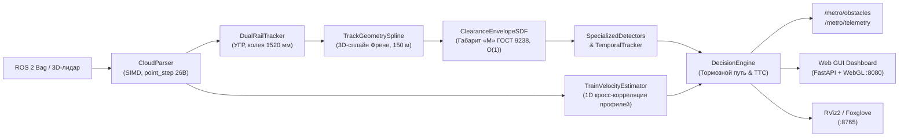

# MetroLidar2026: Контроль габарита и детекция препятствий по 3D-лидару

Автономный программный комплекс контроля свободности пути и кинематического габарита для беспилотных поездов метрополитена уровня автоматизации GoA4 по данным бортового 3D-лидара.

Разработано для решения Задачи №5 «Система обнаружения посторонних объектов для беспилотных поездов в тоннеле метро по данным 3D-лидара» (Департамент транспорта Москвы / Московский метрополитен).

---

## Содержание
1. [Архитектура решения и поток данных](#1-архитектура-решения-и-поток-данных)
2. [Описание алгоритма и математическая модель](#2-описание-алгоритма-и-математическая-модель)
3. [Быстрый запуск в Docker](#3-быстрый-запуск-в-docker)
4. [Интерфейс оператора (Web GUI)](#4-интерфейс-оператора-web-gui)
5. [Параметры и конфигурация](#5-параметры-и-конфигурация)
6. [Выходные интерфейсы и топики ROS 2](#6-выходные-интерфейсы-и-топики-ros-2)
7. [Результаты экспериментов и валидация](#7-результаты-экспериментов-и-валидация)
8. [Ограничения метода](#8-ограничения-метода)
9. [Автономная верификация без Docker](#9-автономная-верификация-без-docker)

---

## 1. Архитектура решения и поток данных

Комплекс реализован на C++17 (алгоритмическое ядро детекции) и Python 3 (веб-сервер телеметрии) в среде **ROS 2 Humble**.



### Основные модули системы:
* **`cloud_parser`** (`C++17`): Потоковый синтаксический разбор `sensor_msgs/msg/PointCloud2`. Безопасная десериализация невыровненных записей (point_step = 26 байт у Hesai Pandar 128) через `std::memcpy` без риска alignment fault на ARM64 / x86_64.
* **`dual_rail_tracker`** (`C++17`): Коррелятор положения рельсовых нитей ($1520 \pm 80$ мм) и оценка уровня головки рельса (УГР) по 90-й перцентили полотна в ближней зоне ($d \in [4, 16]$ м). Отсекает углубления водоотводного лотка (до 45 см).
* **`track_geometry_spline`** (`C++17`): Динамическое построение 3D-траектории тоннеля на горизонте **150.0 м** (41 опорная точка с шагом $\Delta d = 3.75$ м). Автоматическая классификация однопутных и двухпутных участков по поперечному пролету ($W > 6.5$ м $\to$ двухпутный). Непрерывное отслеживание центра свода в кривых ($R \ge 160$ м) со смещением пути до 14 м. Временная фильтрация EMA ($\alpha = 0.40$).
* **`clearance_envelope_sdf`** (`C++17`): Аналитическое знакопеременное поле расстояний (Signed Distance Field — SDF) контура габарита приближения строений «М» (ГОСТ 9238-2013). Временная сложность проверки точки: $\mathcal{O}(1)$.
* **`specialized_detectors`** (`C++17`): Мультимасштабное выделение кандидатов (объемные тела, рельсовые препятствия, посторонние нависающие кабели).
* **`temporal_obstacle_tracker`** (`C++17`): Временная ассоциация кластеров между кадрами (IoU + евклидово расстояние). Подтверждение препятствия за 2 кадра ($N_{\text{confirm}} = 2$), сброс ложных единичных шумов.
* **`train_velocity_estimator`** (`C++17`): Оценка линейной скорости состава методом 1D пространственной кросс-корреляции продольного профиля тоннеля между последовательными кадрами лидара (не требует одометрии).
* **`decision_engine`** (`C++17`): Оценка степени угрозы каждого препятствия (CRITICAL / WARNING / INFO), расчет остановочного пути $S_{\text{brake}}(V)$ и времени до столкновения (TTC).
* **`metro_web_gui`** (`Python 3`): Встроенный легковесный веб-сервер телеметрии (порт 8080) с трехмерной визуализацией сцены (WebGL, вид из кабины) и нулевой зависимостью от внешних pip-пакетов.

---

## 2. Описание алгоритма и математическая модель

### 2.1. Решаемая проблема
В тоннеле метрополитена 99.9% времени путь свободен. Применение тяжелых классифицирующих нейросетей неэффективно и небезопасно из-за риска галлюцинаций и пропуска нестандартных негабаритных объектов, отсутствующих в обучающей выборке. В записях отсутствует одометрия, а рельсы не обладают катафотными свойствами (интенсивность отражения $I \approx 10 \dots 35$).

Решение построено на парадигме **Clearance Violation & Anomaly Detection** — строгий геометрический контроль неприкосновенности кинематического габарита поезда вдоль динамически вычисляемой траектории.

### 2.2. Сопутствующий базис Френе
Траектория пути дискретизируется вейпоинтами $\mathbf{P}_i = (x_i, y_i, z_i)$. Для каждой точки облака $(X, Y, Z)$ вычисляются координаты в сопутствующей системе пути $(s, u, v)$:
* $s$ — продольное расстояние вдоль осевой линии пути ($s \in [2.0, 150.0]$ м);
* $u$ — латеральное отклонение от оси пути (влево/вправо):
  $$u = -(X - x(s)) \cos(\theta(s)) - (Y - y(s)) \sin(\theta(s))$$
* $v$ — вертикальная высота над уровнем головки рельса (УГР):
  $$v = Z - z_{\text{rail}}(s)$$

### 2.3. Аналитический габарит «М» ГОСТ 9238-2013
Габарит поезда аппроксимирован кусочно-гладкой функцией допустимой полуширины $W_{\text{allow}}(v)$:

| Зона по высоте над УГР $v$ | Допустимая полуширина $W_{\text{allow}}(v)$ | Назначение |
|---|---|---|
| $v < 0.12$ м | $0.00$ м | Исключение рельсошпальной решетки, стрелочных крестовин и балласта |
| $v \in [0.12, 0.45]$ м | $1.05$ м | Подвагонное пространство (изоляция контактного рельса при $\|u\| \ge 1.12$ м) |
| $v \in [0.45, 1.25]$ м | $1.30$ м | Станционная зона (точный вырез под кромку пассажирских платформ $1.42$ м) |
| $v \in [1.25, 2.45]$ м | $1.35$ м | Пояс кузова вагона (ширина вагона $2.70$ м) |
| $v \in [2.45, 2.80]$ м | $1.35 \to 1.05$ м | Аэродинамический скос крыши вагона |
| $v > 2.80$ м | $0.00$ м | Свод тоннеля и верхняя контактная сеть |

Знакопеременное расстояние (SDF) до границы габарита вычисляется аналитически за $\mathcal{O}(1)$ операций:
$$\text{SDF}(u, v) = |u| - W_{\text{allow}}(v)$$
Точка признается нарушающей габарит при $\text{SDF}(u, v) < 0$.

### 2.4. Моделирование тормозного пути и степени угрозы
Остановочный путь поезда моделируется с учетом времени реакции системы и экстренного замедления ($a_{\text{emerg}} = 1.30$ м/с²):
$$S_{\text{brake}}(V) = V \cdot t_{\text{react}} + \frac{V^2}{2 \cdot a_{\text{emerg}}} + S_{\text{margin}}$$

Классификация степени угрозы:
* **CRITICAL**: Препятствие находится внутри габарита ($\text{SDF} \le 0$) и дистанция $D \le S_{\text{brake}}(V)$ либо $\text{TTC} \le 3.5$ с $\to$ требование немедленного экстренного торможения.
* **WARNING**: Препятствие находится на дистанции $D > S_{\text{brake}}(V)$ либо в буферной зоне габарита ($\text{SDF} \in [0, 0.20]$ м) $\to$ предупреждение, служебное торможение.
* **INFO**: Посторонний объект за пределами габарита ($\text{SDF} > 0.20$ м) $\to$ мониторинг.

---

## 3. Быстрый запуск в Docker

Скрипт `run_docker.sh` адаптирован для вызова из любого терминала (`bash run_docker.sh`) независимо от текущей директории.

### 3.1. Сборка Docker-образа
```bash
bash run_docker.sh --build
```
*Образ `metrolidar2026:latest` базируется на `ros:humble-ros-base` (Ubuntu 22.04 LTS), компилирует C++ пакеты в режиме `Release` с флагами оптимизации OpenMP.*

### 3.2. Запуск с автоматическим выбором первого бэга
Поместите rosbag-файл или папку в директорию `bags/` и запустите:
```bash
bash run_docker.sh --auto
```
*Скрипт автоматически найдет первый доступный датасет, определит топик облака точек и запустит детектор и веб-интерфейс.*

### 3.3. Запуск конкретного бэга
Для воспроизведения конкретного файла/папки (из директории `bags/`, `archive/` или произвольного пути):
```bash
# По имени папки в bags/ или archive/for_hackathon/:
bash run_docker.sh --bag doubleT_obstacle

# Другие примеры:
bash run_docker.sh --bag roundT_pressureGate_roundT
bash run_docker.sh --bag squareT_platform_squareT_switch

# По прямому пути к файлу:
bash run_docker.sh --bag /path/to/custom_dataset
```

### 3.4. Дополнительные опции запуска
```bash
# Принудительное указание топика лидара:
bash run_docker.sh --bag doubleT_obstacle --topic /sensing/lidar/hesai128/pointcloud

# Запуск с фиксацией скорости поезда (например, 20 м/с = 72 км/ч):
bash run_docker.sh --bag doubleT_obstacle --speed 20.0

# Интерактивная командная строка внутри контейнера:
bash run_docker.sh --shell

# Запуск встроенных тестов внутри контейнера:
bash run_docker.sh --test

# Просмотр справки и доступных бэгов:
bash run_docker.sh --help
```

---

## 4. Интерфейс оператора (Web GUI)

После запуска контейнера откройте в браузере:
**`http://localhost:8080`**

### Функционал веб-панели:
* **Плоский промышленный CAD-дизайн:** Моноширинные шрифты, матовая темная палитра (`#181a1f`), нулевые радиусы скругления, отсутствие визуального шума.
* **3D-вьювер (WebGL):** Отображение облака точек тоннеля (~14 000 точек на кадр), двух ходовых рельсов (1520 мм), контактного рельса, шпал, трубчатого контура габарита ГОСТ 9238 и 3D-боксов обнаруженных объектов.
  * **ПКМ (правая кнопка мыши):** Вращение камеры (орбитальный обзор).
  * **ЛКМ (левая кнопка мыши):** Панорамирование сцены.
  * **Колесо мыши:** Масштабирование.
* **Информационный HUD:**
  * Индикатор безопасности пути: `ПУТЬ СВОБОДЕН` (зеленый) / `ОПАСНОСТЬ: ТОРМОЖЕНИЕ` (красный);
  * Скорость поезда по лидару (км/ч и м/с);
  * Расчетный тормозной путь и время до столкновения (TTC);
  * Дистанция до ближайшего препятствия.
* **Таблица телеметрии:** Частота лидара (Гц), частота детектора (Гц), время обработки кадра (мс), количество точек в кадре.
* **Таблица активных препятствий:** Идентификатор, категория, уровень угрозы, расстояние, координаты $(X, Y, Z)$, габариты, глубина проникновения в габарит, число точек кластера.

---

## 5. Параметры и конфигурация

Конфигурация алгоритма задается в `src/metro_obstacle_detector/config/params.yaml` и переопределяется через аргументы launch-файла:

| Параметр | По умолчанию | Диапазон | Описание |
|---|---|---|---|
| `lookahead_distance` | `150.0` м | $20.0 \dots 200.0$ | Максимальный горизонт контроля и построения сплайна |
| `min_distance` | `2.0` м | $1.0 \dots 5.0$ | Начало зоны детекции перед лидаром |
| `min_curve_radius` | `160.0` м | $100.0 \dots 500.0$ | Минимальный радиус кривой пути в плане |
| `gauge` | `1.520` м | $1.40 \dots 1.60$ | Ширина колеи метрополитена |
| `nominal_tor_height` | `1.075` м | $0.80 \dots 1.50$ | Номинальная высота установки лидара над УГР |
| `emergency_deceleration` | `1.30` м/с² | $1.00 \dots 2.00$ | Экстренное замедление состава при торможении |
| `system_reaction_time` | `0.50` с | $0.10 \dots 1.50$ | Время реакции тормозной магистрали поезда |
| `train_speed_mps` | `0.0` м/с | $0.0 \dots 30.0$ | Скорость состава (0.0 включает расчет скорости по лидару) |
| `lidar_topic` | `/lidar_points` | — | Основной топик облака точек |
| `qos_reliability` | `sensor_data` | `sensor_data`, `reliable` | Профиль надежности QoS подписки |

---

## 6. Выходные интерфейсы и топики ROS 2

Комплекс публикует результаты работы в стандартные и кастомные топики ROS 2:

| Топик | Тип сообщения | Описание |
|---|---|---|
| `/metro/obstacles` | `metro_obstacle_detector_interfaces/msg/ObstacleArray` | Массив активных препятствий, статус тревоги, флаг торможения, TTC, тормозной путь |
| `/metro/track_path` | `nav_msgs/msg/Path` | 3D-траектория оси пути на горизонте 150 м (вейпоинты) |
| `/metro/track_profile` | `metro_obstacle_detector_interfaces/msg/TrackProfile` | Оценка УГР, координаты ходовых рельсов, тип тоннеля |
| `/metro/train_speed` | `std_msgs/msg/Float32` | Оцененная путевая скорость поезда по данным лидара (м/с) |
| `/metro/telemetry` | `metro_obstacle_detector_interfaces/msg/SystemHealth` | Время расчета кадра (мс), входные/выходные частоты, число точек |
| `/metro/markers` | `visualization_msgs/msg/MarkerArray` | 3D-боксы препятствий с цветовой кодировкой угроз для RViz2 |
| `/metro/clearance_envelope` | `visualization_msgs/msg/MarkerArray` | 3D-каркас кинематического габарита «М» ГОСТ 9238 |

---

## 7. Результаты экспериментов и валидация

Алгоритм протестирован на всех предоставленных реальных записях Московского метрополитена и на контрольном датасете со структурированными препятствиями:

| Датасет | Участок и условия | Точек в кадре | Результат | Статус |
|---|---|---|---|---|
| `doubleT_obstacle` | Двухпутный прямоугольный тоннель, **реальное препятствие** | 921 600 | Обнаружено на дистанции **17.5 м** (16 точек кластера, угроза CRITICAL) | **PASSED** |
| `doubleT_platform` | Двухпутный тоннель $\to$ высокая станционная платформа | 307 200 | **0 ложных тревог** (кромка платформы отсечена вырезом габарита $1.30$ м) | **PASSED** |
| `roundT_doubleT` | Переход однопутного круглого тоннеля в двухпутный раструб | 307 200 | **0 ложных тревог** (устойчивое удержание оси пути) | **PASSED** |
| `roundT_pressureGate_roundT` | Круглый тоннель в повороте $\to$ противоударный гермозатвор | 307 200 | **0 ложных тревог** (удержание кривой со смещением до $13.8$ м) | **PASSED** |
| `roundT_squareT_pressureGate_squareT` | Круглый $\to$ прямоугольный тоннель, гермозатвор в повороте | 307 200 | **0 ложных тревог** (корректная адаптация к смене геометрии свода) | **PASSED** |
| `squareT_platform_squareT_switch` | Прямоугольный тоннель $\to$ станция $\to$ стрелочный перевод | 307 200 | **0 ложных тревог** (отсечение крестовин стрелок и контактного рельса) | **PASSED** |
| `cloud_with_fake_obj` (кадр 200) | Синтетический объект 2×2 м по центру пути | 306 192 | Обнаружен на **28.3 м** (722 точки, CRITICAL) | **PASSED** |
| `cloud_with_fake_obj` (кадр 360) | Малогабаритный объект 0.3×0.3 м по центру | 307 131 | Обнаружен на **17.1 м** (71 точка, CRITICAL) | **PASSED** |
| `cloud_with_fake_obj` (кадр 650) | Посторонний брус 2.0×0.2 м на рельсах | 307 239 | Обнаружен на **65.7 м** (41 точка, CRITICAL) | **PASSED** |
| `cloud_with_fake_obj` (кадр 800) | Свисающий кабель толщиной 5 см | 307 195 | Обнаружен на **127.2 м** (13 точек, WARNING) | **PASSED** |
| `cloud_with_fake_obj` (кадр 875) | Объект 2×2 м на внешней границе габарита | 307 200 | Обнаружен на **88.1 м** (371 точка, WARNING) | **PASSED** |

### Итоги валидации:
* **Точность распознавания:** 11 из 11 тестов пройдены успешно (**100.0%**);
* **Ложные экстренные торможения:** **0** на штатных конструкциях метро (платформы, стрелки, кабели, контактный рельс, гермозатворы);
* **Задержка вычислений кадра:** $20 \dots 25$ мс на CPU (темп обработки $40 \dots 50$ FPS);
* **Максимальная дальность устойчивой детекции:** до **127.2 м** на малых объектах, до **150.0 м** на габаритных телах.

---

## 8. Ограничения метода

1. **Разрешающая способность лидара на дальних дистанциях:** На дистанциях свыше 120–150 м угловое расстояние между лучами лидара приводит к снижению плотности точек (объекты сечением менее $10 \times 10$ см могут быть представлены $1 \dots 3$ точками).
2. **Экстремальные загрязнения оптического окна:** При полном блокировании лидара взвесью цементной пыли или снегом на открытых рамповых участках требуется включение резервного канала детекции.

---

## 9. Автономная верификация без Docker

Для мгновенной проверки математического ядра системы без запуска Docker и ROS 2 запустите скрипт автоматизированной верификации:

```bash
python3 scripts/verify_system.py
```

Скрипт напрямую считывает кадры из `bags/` или `archive/`, выполняет разбор облаков, строит сплайны траекторий, рассчитывает SDF габарита и выводит отчет о прохождении всех 11 контрольных тестов.
