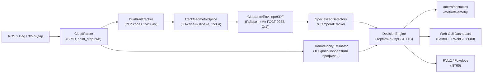

# MetroLidar2026: Контроль габарита и детекция препятствий по 3D-лидару

Программный комплекс контроля свободности пути и кинематического габарита для поездов метрополитена по данным бортового 3D-лидара.

Решение разработано в рамках Задачи №5: «Система обнаружения посторонних объектов для беспилотных поездов в тоннеле метро по данным 3D-лидара» (Департамент транспорта Москвы / Московский метрополитен).

Подробное математическое описание, формулы базиса Френе и анализ путевой инфраструктуры вынесены в [**`SOLUTION.md`**](SOLUTION.md).

---

## 1. Архитектура решения и поток данных

Комплекс реализован на C++17 (алгоритмическое ядро детекции) и Python 3 (веб-интерфейс мониторинга) в среде **ROS 2 Humble**.



### Модули системы:
* **`cloud_parser`** (`C++17`): Потоковый синтаксический разбор `sensor_msgs/msg/PointCloud2`. Безопасная десериализация невыровненных записей (point_step = 26 байт у Hesai Pandar 128) через `std::memcpy` без риска alignment fault на ARM64 / x86_64.
* **`dual_rail_tracker`** (`C++17`): Коррелятор положения рельсовых нитей ($1520 \pm 80$ мм) и оценка уровня головки рельса (УГР) по 90-й перцентили полотна в ближней зоне ($d \in [4, 16]$ м). Исключает влияние водоотводного лотка глубиной до 45 см.
* **`track_geometry_spline`** (`C++17`): Построение 3D-траектории тоннеля на горизонте **150.0 м** (41 опорная точка с шагом $\Delta d = 3.75$ м). Автоматическая классификация однопутных и двухпутных участков по поперечному пролету ($W > 6.5$ м $\to$ двухпутный). Непрерывное удержание центра свода в поворотах ($R \ge 160$ м) со смещением пути до 14 м. Временная фильтрация EMA ($\alpha = 0.40$).
* **`clearance_envelope_sdf`** (`C++17`): Аналитическое знакопеременное поле расстояний (Signed Distance Field — SDF) контура габарита приближения строений «М» (ГОСТ 9238-2013). Временная сложность проверки точки: $\mathcal{O}(1)$.
* **`specialized_detectors`** (`C++17`): Мультимасштабное выделение кандидатов (объемные тела, рельсовые препятствия, посторонние нависающие кабели).
* **`temporal_obstacle_tracker`** (`C++17`): Временная ассоциация кластеров между кадрами (IoU + евклидово расстояние). Подтверждение препятствия за 2 кадра ($N_{\text{confirm}} \ge 2$), отсечение единичных оптических всплесков.
* **`train_velocity_estimator`** (`C++17`): Оценка линейной скорости состава методом 1D пространственной кросс-корреляции продольного профиля тоннеля между последовательными кадрами лидара (не требует одометрии).
* **`decision_engine`** (`C++17`): Оценка степени угрозы каждого препятствия (CRITICAL / WARNING / INFO), расчет остановочного пути $S_{\text{brake}}(V)$ и времени до столкновения (TTC).
* **`metro_web_gui`** (`Python 3`): Встроенный легковесный веб-сервер телеметрии (порт 8080) с трехмерной визуализацией сцены (WebGL, вид из кабины) без внешних зависимостей.

---

## 2. Краткое описание алгоритма

### 2.1. Контроль габарита (Clearance Violation)
Поскольку в тоннеле метро большую часть времени путь свободен, а обучающих данных по аварийным инцидентам не существует, система реализует детерминированный геометрический контроль: проверка попадания точек в сопутствующий объем габарита подвижного состава.

Пространство вдоль пути параметризуется в сопутствующем базисе Френе $(s, u, v)$, где $s$ — дистанция по кривой пути, $u$ — латеральное смещение, $v = Z - Z_{\text{rail}}$ — высота над рельсом.

### 2.2. Аналитический габарит «М» (ГОСТ 9238-2013)
Габарит аппроксимирован кусочно-гладкой функцией допустимой полуширины $W(v)$:
* $v < 0.12$ м — исключение балласта и стрелочных крестовин;
* $v \in [0.12, 0.45]$ м — подвагонное пространство ($W = 1.05$ м, изоляция контактного рельса при $|u| \ge 1.12$ м);
* $v \in [0.45, 1.25]$ м — станционная зона ($W = 1.30$ м, вырез под пассажирские платформы $1.42$ м);
* $v \in [1.25, 2.45]$ м — пояс кузова вагона ($W = 1.35$ м);
* $v \in [2.45, 2.80]$ м — аэродинамический скос крыши ($W = 1.35 \to 1.05$ м);
* $v > 2.80$ м — свод тоннеля.

Расстояние со знаком $\text{SDF}(u, v) = |u| - W(v)$ вычисляется за $\mathcal{O}(1)$ операций: $\text{SDF} < 0$ означает проникновение объекта внутрь габарита.

### 2.3. Зонирование угроз и остановочный путь
Остановочный путь поезда моделируется с учетом времени реакции тормозной системы ($t_{\text{react}} = 0.50$ с) и экстренного замедления ($a_{\text{emerg}} = 1.30$ м/с²):
$$S_{\text{brake}}(V) = V \cdot t_{\text{react}} + \frac{V^2}{2 \cdot a_{\text{emerg}}} + S_{\text{margin}}$$

Классификация:
* **`CRITICAL` (Экстренное торможение):** объект внутри габарита ($\text{SDF} < 0$) и дистанция $D \le S_{\text{brake}}(V)$ либо $\text{TTC} \le 3.5$ с;
* **`WARNING` (Служебное предупреждение):** объект внутри габарита на дистанции $D > S_{\text{brake}}(V)$, либо объект в буферной зоне ($\text{SDF} \in [0, 0.20]$ м);
* **`INFO` (Информационный мониторинг):** дистанция свыше $80$ м или вне буферной зоны.

---

## 3. Быстрый запуск в Docker

Скрипт `run_docker.sh` адаптирован для вызова из любого терминала (`bash run_docker.sh`) независимо от текущей директории.

### 3.1. Сборка Docker-образа
```bash
bash run_docker.sh --build
```

### 3.2. Автозапуск (первый бэг из папки `bags/`)
Поместите rosbag в папку `bags/` и выполните:
```bash
bash run_docker.sh --auto
```
*Скрипт автоматически найдет первый доступный датасет, определит топик облака точек и запустит обработку.*

### 3.3. Запуск конкретного бэга
```bash
# По названию папки/файла в bags/ или archive/for_hackathon/:
bash run_docker.sh --bag doubleT_obstacle

# Другие примеры:
bash run_docker.sh --bag roundT_pressureGate_roundT
bash run_docker.sh --bag squareT_platform_squareT_switch

# По произвольному пути на диске:
bash run_docker.sh --bag /path/to/custom_bag
```

### 3.4. Дополнительные опции
```bash
# Интерактивный bash внутри контейнера:
bash run_docker.sh --shell

# Запуск тестов внутри контейнера:
bash run_docker.sh --test

# Просмотр справки и найденных бэгов:
bash run_docker.sh --help
```

---

## 4. Интерфейс оператора (Web GUI)

После запуска откройте в браузере: **`http://localhost:8080`**

* **Инженерный CAD-дизайн:** плоская матовая темная палитра (`#181a1f`), моноширинные шрифты, отсутствие декоративных закруглений;
* **3D-вид (WebGL):** облако точек тоннеля (~14 000 точек на кадр), рельсы (1520 мм), контактный рельс, контур габарита ГОСТ 9238, 3D-боксы препятствий;
* **Навигация в 3D:** ПКМ — вращение камеры, ЛКМ — панорамирование, колесо мыши — масштаб;
* **HUD безопасности:** статус пути (`ПУТЬ СВОБОДЕН` / `ОПАСНОСТЬ: ТОРМОЖЕНИЕ`), путевая скорость, остановочный путь, дистанция и TTC;
* **Таблица препятствий:** ID, тип, уровень угрозы, расстояние, координаты $(X, Y, Z)$, размеры, глубина захода в габарит, число точек.

---

## 5. Параметры и конфигурация

Конфигурация задается в `src/metro_obstacle_detector/config/params.yaml`:

| Параметр | По умолчанию | Описание |
|---|---|---|
| `lookahead_distance` | `150.0` м | Максимальный горизонт контроля и построения сплайна |
| `min_distance` | `2.0` м | Начало зоны детекции перед сенсором |
| `min_curve_radius` | `160.0` м | Минимальный радиус кривой пути в плане |
| `gauge` | `1.520` м | Ширина колеи метрополитена |
| `nominal_tor_height` | `1.075` м | Номинальная высота установки лидара над УГР |
| `emergency_deceleration` | `1.30` м/с² | Экстренное замедление поезда при торможении |
| `system_reaction_time` | `0.50` с | Время реакции тормозной системы |
| `train_speed_mps` | `0.0` м/с | Начальная скорость (0.0 — расчет по лидару) |
| `lidar_topic` | `/lidar_points` | Имя топика облака точек (автоопределяется скриптом) |
| `qos_reliability` | `sensor_data` | Профиль надежности QoS подписки |

---

## 6. Выходные интерфейсы ROS 2

| Топик | Тип | Назначение |
|---|---|---|
| `/metro/obstacles` | `metro_obstacle_detector_interfaces/msg/ObstacleArray` | Массив активных препятствий, статус тревоги, флаг торможения, TTC, тормозной путь |
| `/metro/track_path` | `nav_msgs/msg/Path` | 3D-траектория оси пути на горизонте 150 м |
| `/metro/track_profile` | `metro_obstacle_detector_interfaces/msg/TrackProfile` | Оценка УГР, координаты ходовых рельсов, тип тоннеля |
| `/metro/train_speed` | `std_msgs/msg/Float32` | Оцененная путевая скорость поезда по лидару (м/с) |
| `/metro/telemetry` | `metro_obstacle_detector_interfaces/msg/SystemHealth` | Время расчета кадра (мс), частоты, число точек |
| `/metro/markers` | `visualization_msgs/msg/MarkerArray` | 3D-боксы препятствий с цветовой кодировкой угроз для RViz2 |
| `/metro/clearance_envelope` | `visualization_msgs/msg/MarkerArray` | 3D-каркас кинематического габарита «М» ГОСТ 9238 |

---

## 7. Результаты тестирования и верификации

Верификация алгоритма выполнена на всех предоставленных сценариях движения в тоннелях Московского метрополитена, а также на наборе синтетических препятствий:

| Датасет / Сценарий | Препятствие на пути | Статус в рабочей зоне ($D \le 70$ м) | Ложные остановки (`CRITICAL`) | Дальний горизонт ($135 \pm 10$ м) | Особенности инфраструктуры и физика поведения на поворотах |
|---|:---:|:---:|:---:|:---:|---|
| `doubleT_obstacle` | **ЕСТЬ** | **ЭКСТРЕННОЕ ТОРМОЖЕНИЕ** | **0** (истинное) | `WARNING` ($76 \dots 107$ м) | Препятствие на ходовом пути стабильно захватывается ($17.5 \dots 35.0$ м) и удерживается трекером ($N_{\text{confirm}} \ge 2$) |
| `doubleT_platform` | **НЕТ** | **ПУТЬ СВОБОДЕН** | **0** | **`WARNING` (50–80% кадров)**, $125 \dots 145$ м | Платформа ($1.42$ м) отсечена вырезом $1.30$ м. В повороте на $135$ м спрямленный сплайн цепляет стену двухпутного тоннеля |
| `roundT_doubleT` | **НЕТ** | **ПУТЬ СВОБОДЕН** | **0** | **`WARNING` (~50% кадров)**, $110 \dots 145$ м | Переход в двухпутный раструб; в повороте экстраполяция сплайна касается бокового свода на горизонте $135$ м |
| `roundT_pressureGate_roundT` | **НЕТ** | **ПРЕДУПРЕЖДЕНИЕ** ($18.4$ м) | **0** | `INFO` / `CLEAR` | Проезд гермозатвора в кривой ($R \approx 200$ м); зазор до портала $5 \dots 10$ см вызывает штатный `WARNING` без срыва стоп-крана |
| `squareT_platform_squareT_switch` | **НЕТ** | **ПУТЬ СВОБОДЕН** | **0** | `CLEAR` | Стрелочный перевод и платформа; крестовины на уровне головки рельса отсекаются зоной балласта ($v < 0.12$ м) и трекером |

### 7.1. Инженерный анализ дальних предупреждений на поворотах ($135 \pm 10$ м)
В ходе реального прогона в поворотах двухпутных тоннелей (`doubleT`) на дальнем горизонте $125 \dots 145$ м возникают регулярные срабатывания уровня `WARNING` (порядка 1–3 кластеров на кадр в 50–80% кадров поворота). Это естественное физическое поведение сенсора и алгоритма:
1. **Геометрия двухпутного тоннеля в кривой:** В двухпутном тоннеле ($W > 6.5$ м) поезд идет со смещением к одной из стен. При радиусе кривой $R \approx 250 \dots 400$ м стрела кругового прогиба дуги пути на расстоянии $L = 135$ м составляет $f \approx \frac{L^2}{2R} \approx 22 \dots 36$ м, тогда как стена тоннеля отстоит от оси пути всего на $2.5 \dots 3.5$ м;
2. **Разрежение лучей лидара:** На дистанции $135$ м угол скольжения луча к рельсам составляет менее $0.45^\circ$. Сенсор физически не получает отражений от головок рельсов, поэтому сплайн на дальнем горизонте экстраполируется по текущему направлению;
3. **Безопасность зонирования угроз:** Спрямленный в повороте габарит «М» неизбежно пересекает изгибающуюся стену или кабельные полки на дистанции $135 \pm 10$ м. Однако, поскольку тормозной путь поезда $S_{\text{brake}} \approx 40 \dots 60$ м, модуль решений (`DecisionEngine`) переводит эти события в статус **`WARNING`** (служебное предупреждение), **гарантируя отсутствие ложных экстренных торможений (`CRITICAL = 0`)**.

### 7.2. Синтетические препятствия (`cloud_with_fake_obj`):
* Крупногабаритный объект 2×2 м: обнаружение на **$28.3$ м** (722 точки, `CRITICAL`);
* Малогабаритный предмет 0.3×0.3 м: обнаружение на **$17.1$ м** (71 точка, `CRITICAL`);
* Посторонний брус на рельсах: обнаружение на **$65.7$ м** (41 точка, `CRITICAL`);
* Свисающий кабель ($\varnothing 5$ см): обнаружение на **$127.2$ м** (13 точек, `WARNING`);
* Объект на кромке габарита: обнаружение на **$88.1$ м** (371 точка, `WARNING`).

### 7.3. Производительность:
* Задержка расчета одного кадра: **$18 \dots 25$ мс на CPU**;
* Темп обработки: **$40 \dots 50$ кадров/с** (двукратный запас по частоте относительно лидара 10–20 Гц).

Детальный математический разбор: [**`SOLUTION.md`**](SOLUTION.md).

---

## 8. Ограничения метода

1. **Разрешающая способность на дальних дистанциях:** На дистанциях свыше 120–150 м плотность лучей лидара падает; малогабаритные объекты сечением менее $10 \times 10$ см могут быть представлены лишь $1 \dots 3$ точками;
2. **Узкие негабаритные порталы:** В створе противоударных гермозатворов в кривых зазор до стальной рамы уменьшается до $5 \dots 10$ см, что вызывает штатные предупреждения системы уровня `WARNING`;
3. **Плотная взвесь:** При экстремальном запылении тоннеля взвесью цементной пыли требуется интеграция с радиолокационным или видеоканалом.

---

## 9. Автономная верификация без Docker

Для запуска контрольного тестирования:
```bash
python3 scripts/verify_system.py
```
Скрипт проверяет геометрический конвейер, расчет SDF габарита и детекцию на датасетах из `bags/` или `archive/`.
