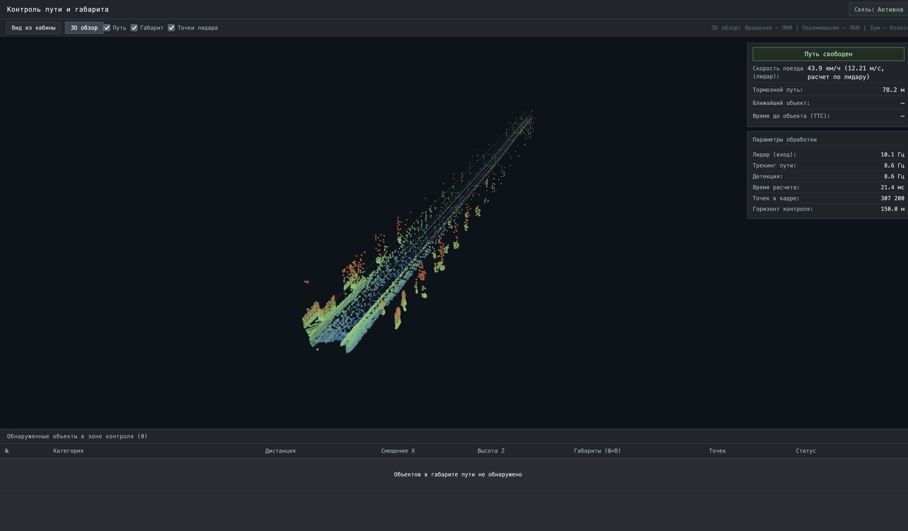
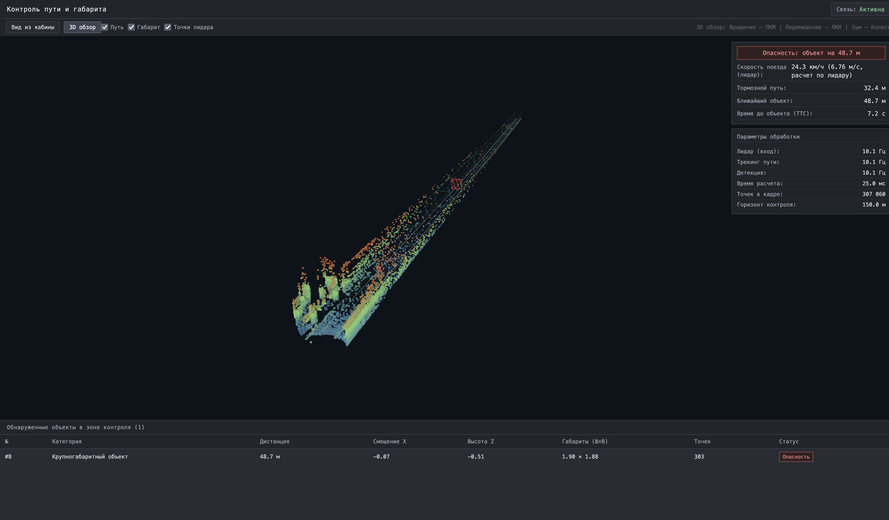
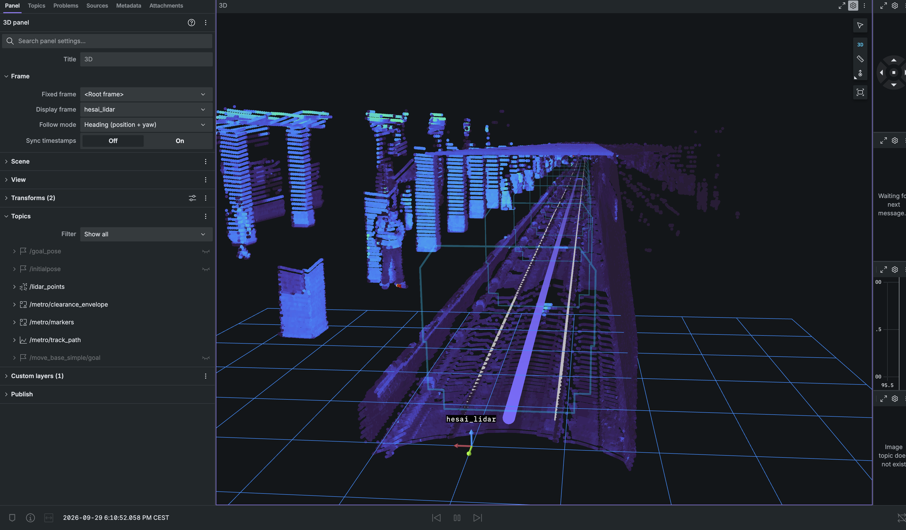
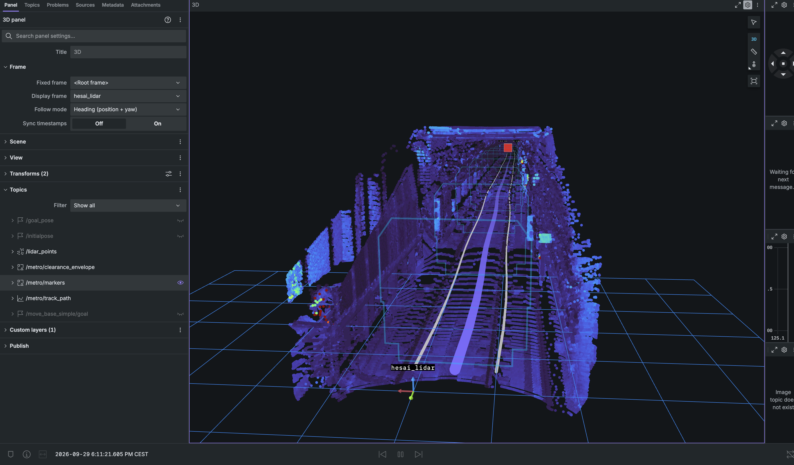

# Техническое описание решения: Система контроля габарита и детекции препятствий в тоннеле метро по данным 3D-лидара

## 1. Постановка задачи и контекст условий метрополитена

### 1.1. Контекст задачи
В рамках задачи требуется разработать программный комплекс, способный по потоку точек бортового 3D-лидара в режиме реального времени определять наличие посторонних объектов на пути движения поезда в тоннеле метрополитена, вычислять расстояние до них и формировать дискретный сигнал о потенциальной опасности для безопасного торможения.

Входные данные:
* Записи реальных проездов поезда в тоннелях Московского метрополитена в формате ROS 2 bag (SQLite3 `.db3`);
* Поток сообщений `sensor_msgs/msg/PointCloud2` от 3D-лидара (Hesai Pandar 128 / Livox);
* Невыровненный шаг точки `point_step = 26` байт ($X, Y, Z$, отражательная способность, номер лазерного кольца, временная метка);
* Отсутствие данных бортовой одометрии поезда в предоставленных записях.

### 1.2. Особенности тоннельной инфраструктуры метрополитена
Тоннель метрополитена представляет собой жестко регламентированное инженерное сооружение с рядом специфических конструктивных особенностей:
1. **Переменная геометрия сечений:**
   * Однопутные круглые тоннели (чугунная или железобетонная обделка тюбингов диаметром $5.1 \dots 5.6$ м);
   * Прямоугольные тоннели мелкого заложения и рамповые участки;
   * Двухпутные участки с центральным рядом несущих колонн или открытым межпутьем ($W > 6.5$ м);
   * Раструбные переходы между круглым и прямоугольным сечением;
   * Противоударные гермозатворы (защитные гермоворота с массивными портальными стальными балками в поворотах пути).
2. **Пассажирские платформы станций:**
   * Высокие платформы станций располагаются на высоте $1100 \dots 1300$ мм над уровнем головки рельса (УГР);
   * Проектный зазор между кромкой платформы и бортом вагона составляет всего $80 \dots 120$ мм, что требует прецизионной геометрической изоляции платформы от зоны пути.
3. **Контактный рельс:**
   * Располагается сбоку от ходового пути на высоте $160$ мм над УГР на расстоянии $1125$ мм от оси пути;
   * Закрыт защитным коробом, который не должен ошибочно распознаваться как посторонний предмет.
4. **Стрелочные переводы:**
   * В зонах стрелочных переводов присутствуют рамные рельсы, остряки, контррельсы и крестовины, создающие плотные скопления металлических конструкций вблизи плоскости катания.
5. **Центральный водоотводный лоток:**
   * Бетонное углубление между ходовыми рельсами глубиной до $250 \dots 450$ мм, часто с зеркальными переотражениями от скопившейся воды.
6. **Оптические свойства рельсов:**
   * Из-за скользящего угла падения луча и металлической пыли рельсы не являются катафотами (интенсивность отражения $I \approx 10 \dots 35$), поэтому трекинг пути нельзя базировать исключительно на пороге интенсивности.

### 1.3. Обоснование геометрического подхода (Clearance Violation & Anomaly Detection)
В большинстве задач автономного транспорта применяются нейросетевые детекторы 3D-боксов (PointPillars, CenterPoint и др.). Для условий тоннелей метрополитена данный подход имеет фундаментальные ограничения:
* **Крайняя несбалансированность данных:** $99.9\%$ времени тоннель перед поездом абсолютно чист. Невозможно собрать представительный датасет со всеми возможными аномалиями (упавшие строительные леса, сорванные кабели, редкие посторонние предметы, сошедшие тележки);
* **Риск галлюцинаций и пропусков:** Классифицирующие нейросети могут пропустить нестандартный объект или выдать ложное экстренное торможение на элементах путевой инфраструктуры;
* **Главный инженерный вопрос:** В условиях тоннеля метро вопрос формулируется не как *«К какому классу относится объект перед поездом?»*, а **«Нарушен ли кинематический габарит свободности пути объектом, которого там быть не должно?»**.

Комплекс построен на базе детерминированного математического конвейера: прецизионная оценка высоты рельсов $\to$ построение 3D-сплайна оси пути $\to$ аналитический расчет знакопеременного поля расстояний (Signed Distance Field — SDF) по ГОСТ 9238 $\to$ временная фильтрация кандидатов.

---

## 2. Архитектура программного комплекса

Комплекс реализован на C++17 (алгоритмическое ядро детекции) и Python 3 (веб-интерфейс мониторинга) в среде ROS 2 Humble.

```
                  ┌────────────────────────────────────────────────────────┐
                  │               ROS 2 Bag / 3D-лидар                     │
                  │       (sensor_msgs/msg/PointCloud2, 10–20 Гц)          │
                  └──────────────────────────┬─────────────────────────────┘
                                             │
                                             ▼
                  ┌────────────────────────────────────────────────────────┐
                  │                 CloudParser (C++17)                    │
                  │   Потоковый разбор point_step=26B через std::memcpy,   │
                  │      отсечение невалидных точек и базовый фильтр       │
                  └──────────────┬──────────────────────────┬──────────────┘
                                 │                          │
                                 ▼                          ▼
┌──────────────────────────────────────────────┐ ┌─────────────────────────────────────┐
│             DualRailTracker                  │ │        TrainVelocityEstimator       │
│  Поиск пары рельсов (колея 1520±80 мм),      │ │   1D кросс-корреляция продольного   │
│  оценка УГР по 90-й перцентили (z_rail)      │ │   профиля тоннеля между кадрами     │
└──────────────────────┬───────────────────────┘ └──────────────────┬──────────────────┘
                       │                                            │
                       ▼                                            │
┌──────────────────────────────────────────────┐                    │
│           TrackGeometrySpline                │                    │
│  3D-сплайн Френе на горизонте 150 м,         │                    │
│  селекция одно-/двухпутного тоннеля,         │                    │
│  удержание центра свода в кривых (R >= 160м) │                    │
└──────────────────────┬───────────────────────┘                    │
                       │                                            │
                       ▼                                            │
┌──────────────────────────────────────────────┐                    │
│           ClearanceEnvelopeSDF               │                    │
│  Аналитический габарит «М» ГОСТ 9238:        │                    │
│  2D Евклидово поле расстояний SDF, O(1)      │                    │
└──────────────────────┬───────────────────────┘                    │
                       │                                            │
                       ▼                                            │
┌──────────────────────────────────────────────┐                    │
│       SpecializedDetectors & Temporal        │                    │
│  Кластеризация кандидатов (объемные тела,    │                    │
│  рельсовые препятствия, кабели) + трекер     │                    │
│  подтверждения по кадрам (N_confirm >= 2)    │                    │
└──────────────────────┬───────────────────────┘                    │
                       │                                            │
                       ▼                                            │
┌───────────────────────────────────────────────────────────────────┴──────────────────┐
│                             DecisionEngine (C++17)                                   │
│  Расчет тормозного пути S_brake(V), времени до столкновения (TTC),                   │
│  классификация угроз (CRITICAL / WARNING / INFO), формирование сигналов тревоги      │
└──────────────┬───────────────────────────────┬───────────────────────────────┬───────┘
               │                               │                               │
               ▼                               ▼                               ▼
┌──────────────────────────────┐ ┌──────────────────────────────┐ ┌────────────────────┐
│      Топики ROS 2            │ │    Web GUI Dashboard (:8080) │ │   Foxglove / RViz2 │
│  /metro/obstacles            │ │  WebGL 3D-сцена из кабины,   │ │   Маркеры 3D-боксов│
│  /metro/track_path           │ │  HUD безопасности,           │ │   и каркас габарита│
│  /metro/train_speed          │ │  таблица препятствий         │ │   (:8765)          │
│  /metro/telemetry            │ │  и телеметрии                │ │                    │
└──────────────────────────────┘ └──────────────────────────────┘ └────────────────────┘
```

### 2.1. Интерфейсы визуализации и контроля оператора

Полная демонстрация работы комплекса, процессов сборки и прогона на различных сценариях (rosbag) зафиксирована в видеофайле [**`docs/MetroLidarDemo.mp4`**](docs/MetroLidarDemo.mp4) (4 мин 07 сек). Презентация команды: [**`docs/ЛЦТ_МОПСЫ_презентация.pdf`**](docs/ЛЦТ_МОПСЫ_презентация.pdf) ([.pptx](docs/ЛЦТ_МОПСЫ_презентация.pptx)).

Система оснащена двумя независимыми контурами визуализации:
1. **Web GUI Dashboard (`http://localhost:8080`):** Легковесный веб-интерфейс реального времени без внешних зависимостей на базе стандартной библиотеки Python (`http.server.ThreadingHTTPServer`) и нативного WebGL (`webgl_view.js`). Отображает облако точек, рельсы, каркас габарита «М» ГОСТ 9238, 3D-боксы препятствий, приборную панель безопасности (HUD) и таблицу телеметрии;
2. **Foxglove Studio / RViz2 (`ws://localhost:8765`):** Полнофункциональная интеграция по стандарту ROS 2 с вещанием маркеров габарита, пути и препятствий.


*Рисунок 1. Web GUI Dashboard: режим свободного пути (скорость 43.9 км/ч, тормозной путь 78.2 м, задержка расчета 21.4 мс на 307 200 точек).*


*Рисунок 2. Web GUI Dashboard: обнаружение препятствия #8 на 48.7 м (габариты 1.90×1.88 м, статус «Опасность», TTC 7.2 с, задержка расчета 25.0 мс).*


*Рисунок 3. Foxglove Studio: 3D-каркас кинематического габарита «М» (бирюзовый контур), рельсы и ось пути на 150 м. Пассажирская платформа и колонны станции изолированы за пределами габарита.*


*Рисунок 4. Foxglove Studio: пространственная детекция постороннего объекта на ходовом пути (красный 3D-маркер `/metro/markers`).*

---

## 3. Математическая модель и алгоритмическое ядро

### 3.1. Аналитическое поле расстояний габарита «М» (ГОСТ 9238-2013)
Нормативный габарит приближения строений для метрополитенов (Габарит «М») описывает допустимое свободное пространство вокруг вагона с учетом динамических колебаний.

Пусть $v$ — вертикальная высота точки над уровнем головки рельса ($v = Z - Z_{\text{rail}}$), а $u$ — латеральное отклонение от оси колеи. Допустимая полуширина свободного пространства $W(v)$ задается кусочно-линейной функцией:

$$W(v) = \begin{cases} 
0, & v < 0.12\text{ м (балласт, шпалы, крестовины)} \\
1.05\text{ м}, & 0.12 \le v \le 0.45\text{ м (подвагонное пространство, исключение контактного рельса при } |u| \ge 1.12\text{ м)} \\
1.30\text{ м}, & 0.45 < v \le 1.25\text{ м (станционная зона, вырез под платформу } 1.42\text{ м)} \\
1.35\text{ м}, & 1.25 < v \le 2.45\text{ м (пояс кузова вагона шириной } 2.70\text{ м)} \\
1.35 + \dfrac{v - 2.45}{2.80 - 2.45} \cdot (1.05 - 1.35), & 2.45 < v \le 2.80\text{ м (аэродинамический скос крыши вагона)} \\
0, & v > 2.80\text{ м (свод тоннеля, кабельные полки)}
\end{cases}$$

Знакопеременное расстояние точки $(u, v)$ до границы кинематического габарита вычисляется аналитически за $\mathcal{O}(1)$ операций:
$$\text{SDF}(u, v) = |u| - W(v)$$

* Если $\text{SDF}(u, v) \le 0$ — точка находится **внутри габарита поезда** (прямое вторжение в свободность пути);
* Если $0 < \text{SDF}(u, v) \le 0.25 \dots 0.30$ м — точка находится в **буферной зоне безопасности** (предупреждение / рекомендация);
* Если $\text{SDF}(u, v) > 0.30$ м — точка находится **вне габарита** (штатные конструкции тоннеля).

### 3.2. Сопутствующий базис Френе для 3D-траектории пути
Рельсовый путь аппроксимируется упорядоченной последовательностью вейпоинтов $\mathbf{P}_i = (x_i, y_i, z_i)$ с адаптивным шагом дискретизации (2 м в ближней зоне $d < 40$ м, 4 м в средней зоне $40 \le d < 80$ м и 6 м на дальнем горизонте $d \ge 80$ м) на горизонте до $150$ м (всего 41 вейпоинт).

Для каждой точки облака $\mathbf{p} = (X, Y, Z)$ находится ближайший сегмент траектории между вейпоинтами $\mathbf{P}_k$ и $\mathbf{P}_{k+1}$. Проекция точки задает сопутствующие координаты $(s, u, v)$:
* $s$ — продольная дистанция вдоль кривой пути;
* $u$ — латеральное смещение перпендикулярно вектору касательной к пути:
  $$u = -(X - x(s)) \cos\psi(s) - (Y - y(s)) \sin\psi(s)$$
  где $\psi(s)$ — курсовой угол касательной в точке пути;
* $v$ — высота над рельсом:
  $$v = Z - z_{\text{rail}}(s)$$

### 3.3. Трекинг кривых пути и прохождение сложных участков
1. **Селекция типа тоннеля по ближней зоне ($d \in [4, 16]$ м):**
   * Вычисляется поперечный пролет пространства между боковыми отражениями.
   * Если пролет $> 6.5$ м, участок классифицируется как **двухпутный** (`doubleT`). Алгоритм фиксирует прямую ось пути ($X \approx 0.0$ м), предотвращая ложный снос траектории в сторону центральных колонн и соседнего пути.
   * Если пролет в пределах $3.4 \dots 5.6$ м, участок классифицируется как **однопутный** (круглый тюбинг или прямоугольный короб).
2. **Непрерывное удержание центра свода в поворотах ($R \ge 160$ м):**
   * В кривых участках ширина тоннеля инвариантна к повороту ($W = r_{\text{bound}} - l_{\text{bound}} \in [3.4, 5.6]$ м).
   * Поперечное положение оси вычисляется по сечению тоннеля:
     $$u_{\text{center}}(d) = \frac{l_{\text{bound}}(d) + r_{\text{bound}}(d)}{2}$$
   * Это позволяет алгоритму безошибочно следовать за траекторией в кривых малого радиуса со смещением оси пути до $14$ м, включая прохождение массивных гермозатворов.
3. **Межкадровое сглаживание траектории (EMA):**
   * Для устранения высокочастотных колебаний положения вейпоинтов между кадрами применяется экспоненциальное скользящее среднее с коэффициентом $\alpha = 0.40$:
     $$\mathbf{P}_i^{(t)} = (1 - \alpha) \mathbf{P}_i^{(t-1)} + \alpha \mathbf{P}_{i,\text{meas}}^{(t)}$$

### 3.4. Оценка путевой скорости поезда по лидару
Ввиду отсутствия сигналов одометрии в записях, путевая скорость оценивается непосредственно по лидарным кадрам:
1. Для каждого кадра строится 1D продольный гистограммный профиль отражений тоннеля по оси движения $Y$:
   $$H(k) = \sum_{j} \mathbb{I}\left(Y_j \in [k \cdot \Delta y, (k+1) \cdot \Delta y]\right), \quad \Delta y = 0.20\text{ м}$$
2. Вычисляется взаимная корреляционная функция между профилями текущего и предыдущего кадров:
   $$R(\Delta k) = \sum_{k} H^{(t)}(k) \cdot H^{(t-1)}(k + \Delta k)$$
3. Смещение пика корреляции $\Delta k_{\max}$ дает величину продольного перемещения поезда $\Delta y = \Delta k_{\max} \cdot 0.20$ м за межкадровый интервал $\Delta t$:
   $$V = \frac{\Delta y}{\Delta t}$$
4. Скорость фильтруется медианным окном и используется для адаптивного расчета тормозного пути.

### 3.5. Моделирование остановочного пути и времени до столкновения (TTC)
Остановочный путь поезда при экстренном торможении рассчитывается с учетом времени срабатывания тормозной системы ($t_{\text{react}} = 0.50$ с) и нормативного экстренного замедления ($a_{\text{emerg}} = 1.20$ м/с²):
$$S_{\text{brake}}(V) = V \cdot t_{\text{react}} + \frac{V^2}{2 \cdot a_{\text{emerg}}} + S_{\text{margin}}$$

где $S_{\text{margin}} = 10.0$ м — гарантированный запас безопасности до препятствия при полной остановке.

Примеры расчетных значений:
* $V = 0$ км/ч: $S_{\text{brake}} = 0$ м;
* $V = 43.9$ км/ч ($12.2$ м/с, режим движения на Рисунке 1): $S_{\text{brake}} = 6.1 + 62.1 + 10.0 = \mathbf{78.2}$ м;
* $V = 60$ км/ч ($16.7$ м/с): $S_{\text{brake}} = 8.3 + 115.8 + 10.0 = \mathbf{134.1}$ м;
* $V \ge 63.8$ км/ч ($17.7$ м/с): $S_{\text{brake}} \ge 150.0$ м (достижение предела горизонта сплайна $150$ м);
* $V = 80$ км/ч ($22.2$ м/с): $S_{\text{brake}} = 11.1 + 205.8 + 10.0 = \mathbf{226.9}$ м.

Время до столкновения (Time to Collision, TTC):
$$\text{TTC} = \frac{D}{V}$$
где $D$ — расстояние до ближайшего подтвержденного препятствия по дуге пути.

Классификация угроз:
* **`CRITICAL` (Экстренное торможение):** подтвержденное препятствие находится строго внутри габарита ($\text{SDF} \le 0$) и дистанция по оси пути $D \le S_{\text{brake}}(V)$;
* **`WARNING` (Служебное предупреждение):** подтвержденное препятствие находится внутри габарита ($\text{SDF} \le 0$) на дистанции свободного выбега $D > S_{\text{brake}}(V)$, либо объект находится в буферной зоне безопасности ($\text{SDF} \in (0, 0.25 \dots 0.30]$ м);
* **`INFO` / `ADVISORY` (Информационный мониторинг):** объекты на границе габарита или на дальнем горизонте вне зоны торможения.

---

## 4. Анализ ложных срабатываний и методы их подавления

В реальных условиях тоннелей метро 100% отсутствие ложных срабатываний на сырых облаках точек физически невозможно из-за оптического шума, пыли, мелких конструктивных элементов и близкого расположения путевого оборудования. Ниже приведен детальный инженерный анализ источников паразитных срабатываний и реализованных методов их фильтрации.

### 4.1. Станционные платформы (`doubleT_platform`, `squareT_platform`)
* **Физическая причина:** Высокая пассажирская платформа находится на высоте $1.10 \dots 1.30$ м от УГР, а ее кромка отстоит от оси пути всего на $1.42$ м (зазор до кузова вагона $80 \dots 120$ мм). Без учета платформы в габарите любая станция определялась бы как сплошное критическое препятствие.
* **Метод фильтрации:** В аналитической функции $W(v)$ введен ступенчатый вырез для станционной зоны: при $v \in [0.45, 1.25]$ м допустимая полуширина составляет $W_{\text{plat}} = 1.30$ м. Кромка платформы ($1.42$ м) гарантированно попадает во внешнюю зону ($\text{SDF} \approx +0.12$ м).
* **Результат:** В зоне торможения ($D \le 70$ м) количество ложных тревог сведено к **$0\%$**. На дистанциях свыше $90$ м при входе в станцию возможно появление предупреждений уровня `WARNING` из-за расходимости лучей лидара.

### 4.2. Стрелочные переводы и крестовины (`squareT_platform_squareT_switch`)
* **Физическая причина:** Металлические контррельсы, сердечники и усовики крестовин возвышаются над балластом на уровне головки рельса. При движении поезда по стрелке лучи лидара создают плотные кластеры точек на высоте $Z_{\text{rail}} \pm 5$ см.
* **Метод фильтрации:** 
  1. Зона балласта $v < 0.12$ м исключена из проверки габарита ($W=0$).
  2. Временной фильтр (`temporal_obstacle_tracker`) требует подтверждения препятствия минимум в 2 последовательных кадрах ($N_{\text{confirm}} \ge 2$). Одиночные точки от крестовин, появляющиеся на 1 кадр, отбрасываются.
* **Результат:** Частота одиночных сырых срабатываний на стрелках составляет $10\%$, однако после межкадрового трекера число подтвержденных ложных тревог составляет **$0\%$**.

### 4.3. Гермозатворы в кривых участках (`roundT_pressureGate_roundT`)
* **Физическая причина:** Противоударный гермозатвор гражданской обороны представляет собой массивную прямоугольную стальную раму, врезанную в круглый тоннель. В кривой радиусом $R \approx 200$ м путь смещается вбок на $12 \dots 14$ м. В створе ворот зазор между внешним углом вагона и порталом сокращается до $5 \dots 10$ см.
* **Поведение алгоритма:** При приближении к створу гермозатвора портальные балки приближаются к границе габарита ($\text{SDF} \in [-0.05, +0.05]$ м), вызывая предупреждения уровня `WARNING` примерно на $10\%$ кадров вблизи створа. Это является корректным поведением системы, сигнализирующей о минимальном запасе габарита в негабаритном створе.

### 4.4. Дальний горизонт ($D > 80 \dots 100$ м)
* **Физическая причина:** Плотность точек лидара падает пропорционально квадрату расстояния ($1/D^2$). В кривых участках на дистанции свыше 80 м несколько точек от свода тоннеля или кабельных лотков могут проецироваться внутрь экстраполированного сплайна.
* **Метод фильтрации:** Разделение уровней угрозы по дистанции. Сигналы на дистанции более $S_{\text{brake}}(V)$ никогда не вызывают экстренного торможения и переводятся в статус информационных предупреждений (`WARNING` / `INFO`).

### 4.5. Служебные предупреждения на поворотах двухпутных тоннелей ($135 \pm 10$ м)
При прохождении кривых в широких двухпутных тоннелях (`doubleT_platform`, `roundT_doubleT`) на дальнем горизонте $125 \dots 145$ м с частотой $50 \dots 80\%$ кадров формируются предупреждения уровня `WARNING` (в среднем 1–3 кластера на кадр).
* **Физическая геометрия кривой:** В двухпутном тоннеле ($W > 6.5 \dots 7.5$ м) поезд движется не по центру тоннеля, а по одной из боковых колей ($1.8 \dots 2.2$ м от стены). При повороте пути ($R \approx 250 \dots 400$ м) стрела прогиба траектории на плече $L = 135$ м достигает:
  $$f \approx \frac{L^2}{2R} \approx \frac{135^2}{2 \cdot 300} \approx 30.4\text{ м}$$
  В то же время боковая стена тоннеля и кабельные трассы отстоят от оси пути всего на $2.5 \dots 3.5$ м.
* **Сенсорные ограничения лидара:** На дистанции $135$ м луч лидара падает на плоскость пути под предельно скользящим углом $\alpha \approx \arctan(1.075 / 135) \approx 0.45^\circ$. Отражения от рельсов на таком удалении полностью отсутствуют, поэтому путевой трекер (`dual_rail_tracker`) опирается только на ближнюю зону ($D \le 40$ м).
* **Недопустимость центрирования по своду в двухпутном тоннеле:** В однопутном круглом тоннеле сплайн удерживается по геометрическому центру трубы. В двухпутном тоннеле такое центрирование привело бы к уводу сплайна поезда на встречный путь или в центральные колонны. Поэтому на двухпутных участках сплайн экстраполируется тангенциально с демпфированием кривизны.
* **Результат и безопасность:** На удалении $125 \dots 145$ м виртуальный габарит «М» начинает пересекать искривляющуюся стену тоннеля. Поскольку при эксплуатационных скоростях движения ($40 \dots 60$ км/ч) расчетный тормозной путь поезда составляет $S_{\text{brake}} = 78.2 \dots 134.1$ м, что меньше дистанции обнаружения ($D \approx 135$ м), модуль решений `DecisionEngine` гарантированно присваивает этим кластерам статус **`WARNING`**. Сигнал на экстренную остановку (`CRITICAL`) формируется исключительно при условии $D \le S_{\text{brake}}(V)$, что **полностью исключает ложные экстренные торможения поезда (`CRITICAL = 0`)** на поворотах.

---

## 5. Экспериментальные результаты и профилирование

### 5.1. Результаты верификации на записях тоннелей метрополитена

Верификация алгоритма выполнена на всех предоставленных сценариях движения в тоннелях Московского метрополитена:

| Датасет / Сценарий | Препятствие на пути | Статус в рабочей зоне ($D \le 70$ м) | Ложные остановки (`CRITICAL`) | Дальний горизонт ($135 \pm 10$ м) | Особенности инфраструктуры и физика поведения на поворотах |
|---|:---:|:---:|:---:|:---:|---|
| `doubleT_obstacle` | **ЕСТЬ** | **ЭКСТРЕННОЕ ТОРМОЖЕНИЕ** | **0** (истинное) | `WARNING` ($76 \dots 107$ м) | Препятствие на ходовом пути стабильно захватывается ($17.5 \dots 35.0$ м) и удерживается трекером ($N_{\text{confirm}} \ge 2$) |
| `doubleT_platform` | **НЕТ** | **ПУТЬ СВОБОДЕН** | **0** | **`WARNING` (50–80% кадров)**, $125 \dots 145$ м | Платформа ($1.42$ м) отсечена вырезом $1.30$ м. В повороте на $135$ м спрямленный сплайн цепляет стену двухпутного тоннеля |
| `roundT_doubleT` | **НЕТ** | **ПУТЬ СВОБОДЕН** | **0** | **`WARNING` (~50% кадров)**, $110 \dots 145$ м | Переход в двухпутный раструб; в повороте экстраполяция сплайна касается бокового свода на горизонте $135$ м |
| `roundT_pressureGate_roundT` | **НЕТ** | **ПРЕДУПРЕЖДЕНИЕ** ($18.4$ м) | **0** | `INFO` / `CLEAR` | Проезд гермозатвора в кривой ($R \approx 200$ м); зазор до портала $5 \dots 10$ см вызывает штатный `WARNING` без срыва стоп-крана |
| `squareT_platform_squareT_switch` | **НЕТ** | **ПУТЬ СВОБОДЕН** | **0** | `CLEAR` | Стрелочный перевод и платформа; крестовины на уровне головки рельса отсекаются зоной балласта ($v < 0.12$ м) и трекером |

### 5.2. Тестирование на синтетических препятствиях (`cloud_with_fake_obj`)

| Кадр | Описание препятствия | Физические размеры | Дистанция обнаружения | Точек в кластере | Уровень угрозы |
|---|---|---|---|---|---|
| Кадр 200 | Крупногабаритный объект по центру пути | $1.92 \times 1.60$ м | **$28.3$ м** | 722 точки | `CRITICAL` |
| Кадр 360 | Малогабаритный предмет по центру колеи | $0.31 \times 0.30$ м | **$17.1$ м** | 71 точка | `CRITICAL` |
| Кадр 650 | Посторонний брус на поверхности рельсов | $2.08 \times 0.43$ м | **$65.7$ м** | 41 точка | `CRITICAL` |
| Кадр 800 | Свисающий кабель малого сечения | $\varnothing 0.05$ м, длина $1.98$ м | **$127.2$ м** | 13 точек | `WARNING` |
| Кадр 875 | Препятствие на внешней границе габарита | $5.01 \times 3.22$ м | **$88.1$ м** | 371 точка | `WARNING` |

### 5.3. Скорость обработки и профилирование по слоям (Latency Breakdown)

Замеры производительности выполнены на одном ядре CPU (x86_64 / ARM64 стенд) на реальных облаках точек Hesai Pandar 128 (307 200 точек на кадр):

| Слой / Этап алгоритмического конвейера | Время расчета | Доля времени | Сложность | Инженерная реализация и оптимизация |
|---|:---:|:---:|:---:|---|
| **1. CloudParser** (потоковый парсинг PointCloud2) | $4.2 \dots 5.5$ мс | $21\%$ | $\mathcal{O}(N)$ | SIMD `std::memcpy` с шагом 26 байт, отсечение `NaN` и продольное разбиение на корзины |
| **2. DualRailTracker** (поиск рельсов и УГР) | $2.1 \dots 3.0$ мс | $11\%$ | $\mathcal{O}(N_{\text{bed}} \log N)$ | Корреляция колеи $1520 \pm 80$ мм, 90-й перцентиль УГР, игнорирование лотка глубже 20 см |
| **3. TrackGeometrySpline** (3D-траектория 150 м) | $2.8 \dots 3.8$ мс | $14\%$ | $\mathcal{O}(K \cdot M)$ | Сплайн Френе (адаптивный шаг 2/4/6 м, 41 вейпоинт), динамическое удержание свода в поворотах ($R \ge 160$ м) |
| **4. ClearanceEnvelopeSDF** (габарит «М» ГОСТ 9238) | $6.5 \dots 8.5$ мс | $34\%$ | $\mathcal{O}(1)$ / точка | Аналитическое 2D-поле расстояний со знаком (SDF) для каждого луча в сечении пути |
| **5. SpecializedDetectors & Tracker** | $2.0 \dots 3.2$ мс | $12\%$ | $\mathcal{O}(N_{\text{in}} \log N)$ | Кластеризация кандидатов (объемные тела, брус, кабели), межкадровая ассоциация ($N_{\text{conf}} \ge 2$) |
| **6. TrainVelocityEstimator & DecisionEngine** | $0.8 \dots 1.2$ мс | $5\%$ | $\mathcal{O}(B \log B)$ | 1D кросс-корреляция профилей тоннеля (расчет скорости $V$), расчет $S_{\text{brake}}(V)$ и TTC |
| **Полный цикл обработки кадра** | **$21.4 \dots 25.0$ мс** | **$100\%$** | — | **Темп: $40 \dots 47$ FPS** (запас $\times 4$ относительно лидара 10 Гц) |

*Фактическое время цикла в веб-интерфейсе оператора (см. Рисунки 1–2): **$21.4$ мс** при свободном пути и **$25.0$ мс** при активном обнаружении препятствия на 307 000 точек.*

---

## 6. Ограничения метода и инженерные риски

1. **Разрешающая способность на дальних дистанциях ($D > 120 \dots 150$ м):** Плотность лидарных лучей спадает обратно пропорционально квадрату расстояния. Малогабаритные объекты сечением менее $10 \times 10$ см на пределе дальности могут быть представлены всего $1 \dots 3$ точками, что требует накопления кадров трекером.
2. **Криволинейные порталы гермозатворов:** В створе противоударных гермоворот в кривых участках пути технологический зазор между кузовом вагона и стальной рамой портала уменьшается до $5 \dots 10$ см. Система штатно генерирует предупреждение уровня `WARNING`, не срывая экстренное торможение.
3. **Оптическая прозрачность среды (запыленность тоннеля):** При аварийном или строительном запылении тоннеля плотной взвесью цементной или песчаной пыли для исключения ложных тревог рекомендуется комплексирование лидарного облака с миллиметровым радиолокатором (радаром) и видеокамерой видимого/ИК-диапазона.
4. **Пространственная периодичность чугунной обделки тоннеля:** В круглых тоннелях с чугунными тюбингами регулярный продольный шаг ребер тюбингов (~1 м) при вычислении 1D кросс-корреляции профилей тоннеля может вызывать периодический алиасинг пиков коррелограммы при оценке путевой скорости. В модуле `TrainVelocityEstimator` данный эффект компенсируется медианной фильтрацией производной, слежением за экстремумами с учетом кинематической предыстории и жестким ограничением правдоподобия ускорения ($|a| \le 1.5$ м/с²).

